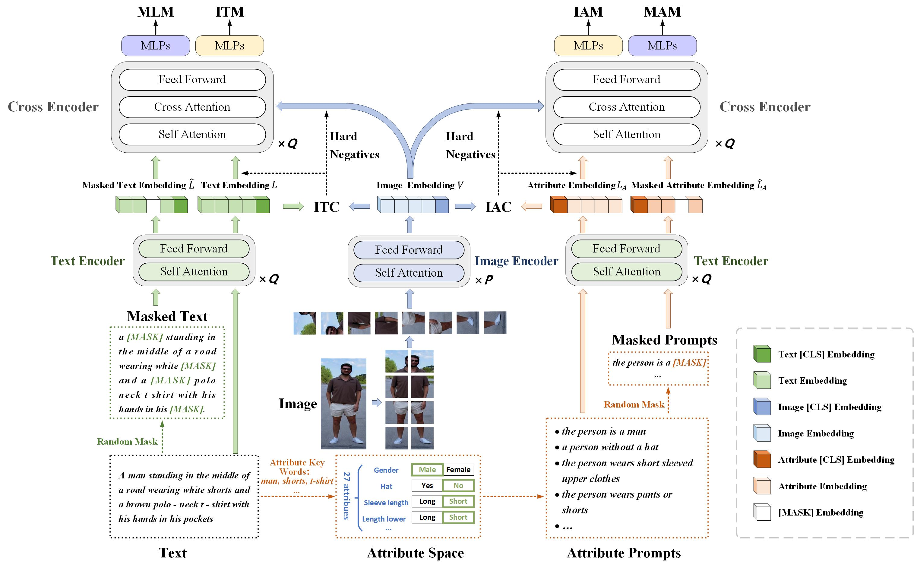
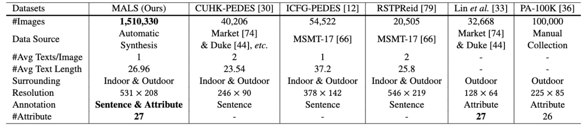
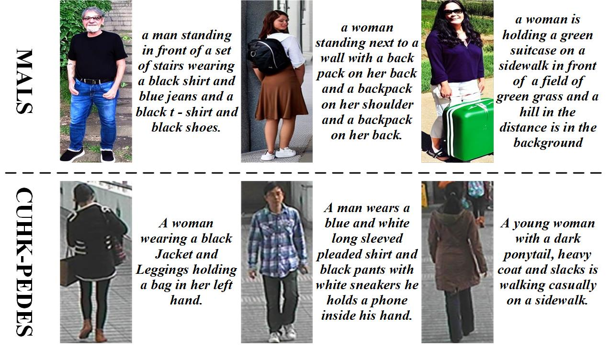

# APTM

------

**APTM** is a new joint **A**ttribute **P**rompt Learning and **T**ext **M**atching Learning framework, considering the shared knowledge between attribute and text. As the name implies, APTM contains an attribute prompt learning stream and a text matching learning stream.

We also present a large Multi-Attribute and Language Search dataset for text-based person retrieval, called **MALS**, and explore the feasibility of performing pre-training on both attribute recognition and image-text matching tasks in one stone. In particular, MALS contains 1, 510, 330 image-text pairs, which is about 37.5× larger than prevailing CUHK-PEDES, and all images are annotated with 27 attributes. 

Extensive experiments validate the effectiveness of the pre-training on MALS, achieving the state-of-the-art retrieval performance via APTM on three challenging real-world benchmarks. In particular, APTM achieves a consistent improvement of +6.60%, +7.39%, and +15.90% Recall@1 accuracy on CUHK-PEDES, ICFG-PEDES, and RSTPReid datasets by a clear margin, respectively. More details can be found at our paper: [Towards Unified Text-based Person Retrieval: A Large-scale Multi-Attribute and Language Search Benchmark](https://arxiv.org/abs/2306.02898)
<div align="center"></div>

## News
* The **APTM** is released. Welcome to communicate！

## MALS
MALS leverages generative models to generate a large-scale dataset including 1.5𝑀 image-text pairs. Each image-text pair in MALS is annotated with one corresponding description and several appropriate attribute labels, indicating that MALS is not only effective for text-image matching and attribute prompt learning, but also explores the feasibility of pre-training for both attribute recognition and image-text matching in one stone.The dataset is released at [Baidu Yun](here is the link). 

**Note that MALS can only be used for research, any commercial usage is forbidden.**

This is the comparison between MALS and other text based person retrieval datasets. 
<div align="center"></div>
These are examples of our MALS dataset and CUHK-PEDES.
<div align="center"></div>
Annotation format:

```
这里是item例子
```

## Models

The checkpoints have been released at [Baidu Yun](link1) and [Google Drive](link2)
(model结构介绍和实验结果,不需要就不加了)

## Usage

### Install Requirements

we use 4 RTX3090 24G GPU for training and evaluation.

Create conda environment.

```
conda create --name APTM --file requirements.txt
conda activate APTM
```

### Datasets Prepare

Download the CUHK-PEDES dataset from [here](https://github.com/ShuangLI59/Person-Search-with-Natural-Language-Description) , the pa100k dataset from [here](), the RSTPReid dataset from [here](), and ICFG-PEDES dataset from [here](https://github.com/zifyloo/SSAN).
(还有pa100k 和 RSTPReid链接)
(swin_base_patch4_window7_224_22k.pth、g_c_g_a_0_attrs.json等的链接)
Organize `data` folder as follows:

```
|-- data/
|		|-- bert-base-uncased
|       |-- 没写
|		|-- finetune
|       |-- gene_attrs
|            |-- g_4x_attrs.json
|            |-- g_c_g_a_0_attrs.json
|            |-- ...
|            |-- g_c_g_a_7_attrs.json
|		|-- swin_base_patch4_window7_224_22k.pth
```

And organize those datasets in `images` folder as follows:

```
|-- images/
|   |-- <CUHK-PEDES>/
|       |-- imgs
|            |-- cam_a
|            |-- cam_b
|            |-- ...
|       |-- reid_raw.json
|
|   |-- <ICFG-PEDES>/
|       |-- imgs
|            |-- test
|       				|-- 没写
|            |-- train 
|       				|-- 没写
|
|   |-- <pa100k>/
|       |-- release_data
|            |-- 没写
|       |-- ...
|       |-- 没写
|       |-- 没写
|   |-- <RSTPReid>/
|       |-- 没写
|       |-- ...
|       |-- 没写
|       |-- 没写
```

### Pretraining  Inference
We pretrain our APTM using MALS as follows：

```
python run.py 
CUDA_VISIBLE_DEVICES=0,1,2,3 
没写
```

### Fine-tuning Inference
We fine-tune our APTM using existing person-reid datasets. Performance can be improved through replacing the backbone with our pre-trained model. Taking CUHK-PEDES as example:

```
python run.py 
CUDA_VISIBLE_DEVICES=0,1,2,3 
没写
```

## Reference
If you use APTM in your research, please cite it by the following BibTeX entry:

```
@article{yang2023towards,
  title={Towards Unified Text-based Person Retrieval: A Large-scale Multi-Attribute and Language Search Benchmark},
  author={Yang, Shuyu and Zhou, Yinan and Wang, Yaxiong and Wu, Yujiao and Zhu, Li and Zheng, Zhedong},
  journal={arXiv preprint arXiv:2306.02898},
  year={2023}
}

```
